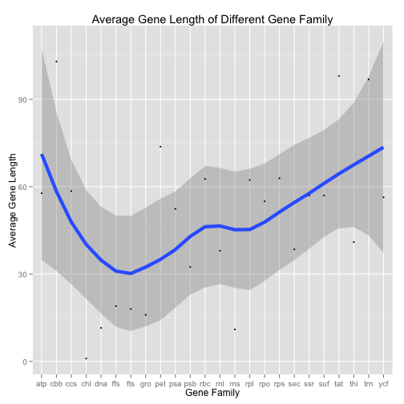
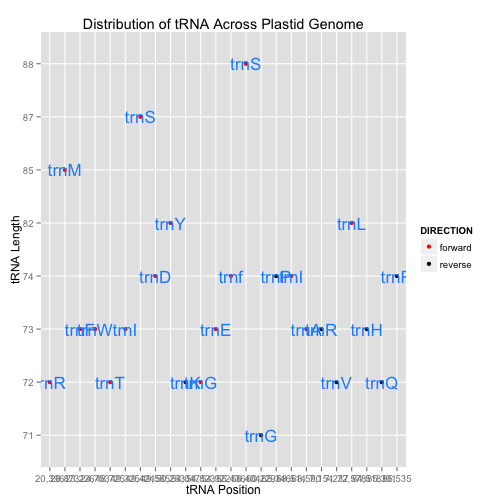
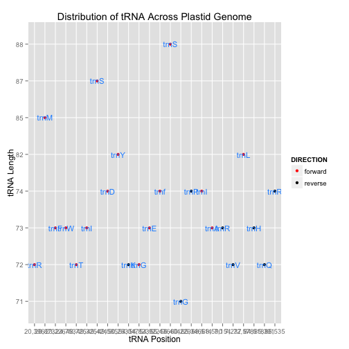

## DV_RProject2
========================================================
#### Group member: Anna Mengjie Yu (my3852),  Duy Vu (dhv242),  Syed Naqvi (san724)

Gene content and gene order have been useful characters in studying speceis evolution. In this project, we will be using diatom plastid genome data. This is a table of Cyclotella (Diatoms) plastid genome gene content, gene length and gene order table from Yu's publication [http://journals.plos.org/plosone/article?id=10.1371/journal.pone.0107854]
This csv table is accessible as part of Table S4 in the Supporting Information.

*********
First, we displayed a few lines of the dataset stored in oracle database. The table includes Name(gene name), MINIMUM (gene start position), MAXIMUM(gene end position), LENGTH(gene length), DIRECTION(sense and anti-sense strand).


```r
source("../01 Data/DV_RProject2_data.R", echo = TRUE)
```

```
## 
## > require("dplyr")
```

```
## Loading required package: dplyr
## 
## Attaching package: 'dplyr'
## 
## The following object is masked from 'package:stats':
## 
##     filter
## 
## The following objects are masked from 'package:base':
## 
##     intersect, setdiff, setequal, union
```

```
## 
## > require("ggplot2")
```

```
## Loading required package: ggplot2
```

```
## 
## > require("RCurl")
```

```
## Loading required package: RCurl
## Loading required package: bitops
```

```
## 
## > require("reshape2")
```

```
## Loading required package: reshape2
```

```
## 
## > require("tidyr")
```

```
## Loading required package: tidyr
```

```
## 
## > require("grid")
```

```
## Loading required package: grid
```

```
## 
## > require("gplots")
```

```
## Loading required package: gplots
## 
## Attaching package: 'gplots'
## 
## The following object is masked from 'package:stats':
## 
##     lowess
```

```
## 
## > df_cyclotella1 <- data.frame(eval(parse(text = substring(getURL(URLencode("http://129.152.144.84:5001/rest/native/?query=\"select * from gene\""), 
##  .... [TRUNCATED] 
## 
## > df_cyclotella1 %>% tbl_df
## Source: local data frame [140 x 5]
## 
##              NAME MINIMUM MAXIMUM LENGTH DIRECTION
## 1       psaA gene     103   2,361  2,259   forward
## 2       psaB gene   2,478   4,679  2,202   forward
## 3       petF gene   4,912   5,244    333   reverse
## 4      rpl20 gene   5,425   5,844    420   reverse
## 5      rpl35 gene   5,854   6,048    195   reverse
## 6      ycf42 gene   6,055   6,690    636   reverse
## 7       psaE gene   6,792   6,989    198   reverse
## 8  trnR(ucu) gene   7,154   7,226     73   reverse
## 9  trnV(uac) gene   7,237   7,308     72   reverse
## 10      psbH gene   7,575   7,775    201   reverse
## ..            ...     ...     ...    ...       ...
```
**********
Then, we created 3 data wrangling set:
  + **df_gene** : we created an extra column named "gene family" by usring substr function to extract the     first three letter in the Name, and group the table by gene_family
  
  + **df_avg_len** : We grouped the df_gene dataset by gene family and usmmarise the average gene length in each gene family
  
  + **df_tRNA**:We selected all the columns from the df_gene dataset, and filter the table by the gene family matching trn,then we created another column named tRNA type.
  

```r
source("../02 Data Wrangling/geneFamily.R", echo = TRUE)
```

```
## 
## > df_gene <- df_cyclotella1 %>% mutate(gene_family = substr(NAME, 
## +     1, 3)) %>% group_by(gene_family)
## 
## > df_gene %>% tbl_df
## Source: local data frame [140 x 6]
## 
##              NAME MINIMUM MAXIMUM LENGTH DIRECTION gene_family
## 1       psaA gene     103   2,361  2,259   forward         psa
## 2       psaB gene   2,478   4,679  2,202   forward         psa
## 3       petF gene   4,912   5,244    333   reverse         pet
## 4      rpl20 gene   5,425   5,844    420   reverse         rpl
## 5      rpl35 gene   5,854   6,048    195   reverse         rpl
## 6      ycf42 gene   6,055   6,690    636   reverse         ycf
## 7       psaE gene   6,792   6,989    198   reverse         psa
## 8  trnR(ucu) gene   7,154   7,226     73   reverse         trn
## 9  trnV(uac) gene   7,237   7,308     72   reverse         trn
## 10      psbH gene   7,575   7,775    201   reverse         psb
## ..            ...     ...     ...    ...       ...         ...
## 
## > df_avg_len <- df_gene %>% group_by(gene_family) %>% 
## +     summarise(avg_gene_length = mean(LENGTH))
## 
## > df_avg_len %>% tbl_df
## Source: local data frame [24 x 2]
## 
##    gene_family avg_gene_length
## 1          atp           57.75
## 2          cbb          103.00
## 3          ccs           58.50
## 4          chl            1.00
## 5          dna           11.50
## 6          ffs           19.00
## 7          fts           18.00
## 8          gro           16.00
## 9          pet           73.75
## 10         psa           52.40
## ..         ...             ...
## 
## > df_tRNA <- df_gene %>% select(NAME, MINIMUM, MAXIMUM, 
## +     LENGTH, DIRECTION) %>% filter(gene_family == "trn") %>% mutate(tRNA_type = substr(NAME, .... [TRUNCATED] 
## 
## > df_tRNA %>% tbl_df
## Source: local data frame [24 x 7]
## 
##    gene_family           NAME MINIMUM MAXIMUM LENGTH DIRECTION tRNA_type
## 1          trn trnR(ucu) gene   7,154   7,226     73   reverse      trnR
## 2          trn trnV(uac) gene   7,237   7,308     72   reverse      trnV
## 3          trn trnR(ccg) gene  20,396  20,467     72   forward      trnR
## 4          trn trnM(cau) gene  20,873  20,957     85   forward      trnM
## 5          trn trnF(gaa) gene  23,226  23,298     73   forward      trnF
## 6          trn trnW(cca) gene  24,753  24,825     73   forward      trnW
## 7          trn trnT(ugu) gene  48,725  48,796     72   forward      trnT
## 8          trn trnI(cau) gene  49,325  49,397     73   forward      trnI
## 9          trn trnS(gcu) gene  49,424  49,510     87   forward      trnS
## 10         trn trnD(guc) gene  49,585  49,658     74   forward      trnD
## ..         ...            ...     ...     ...    ...       ...       ...
```

**********
**Figure 1**

In figure 1, the x axis stands for different gene family, y axis stands for gene number. Red color indicates genes in forward(sense strand) direction, and dark green color indicates genes in reverse (anti-sense) strand. From this figure, we can easily see the group trn has the largest number of different genes, while some gene family only have genes in one direction. 


```r
source("../03 Visualizations/DV2_Visualization.R", echo = TRUE)
```

```
## 
## > ggplot(data = df_gene, mapping = aes(x = gene_family)) + 
## +     layer(geom = "bar", mapping = aes(fill = DIRECTION)) + labs(title = "Number of Genes ..." ... [TRUNCATED]
```

 

**Figure 2**

In figure 2, the x axis stands for different gene family, y axis stands for average gene length. The blue line is the smooth trend line, and the dark grey is the standard Deviation. In this figure, we can easily see which gene family has the longest gene length.


```r
source("../03 Visualizations/DV2_Visualization2.R", echo = TRUE)
```

```
## 
## > ggplot(df_avg_len, aes(y = avg_gene_length, x = gene_family, 
## +     group = 1)) + stat_smooth(se = TRUE, size = 2, method = loess) + 
## +     geom_poi .... [TRUNCATED]
```

 

**Figure 3**

In figure 3, the x axis stands for the position of the plastid genome, y axis stands for tRNA length. In this figure, we can see trnS has the longest gene length, and it appears twice in the genome. This figure also shows us the tRNA (transfer RNA, involved in protein synthesis) distribution in the genome. The distribution is almost even, which makes the protein synthesis more efficient.
(The x axis will display better in zoomin format)


```r
source("../03 Visualizations/DV2_Visualization3.R", echo = TRUE)
```

```
## 
## > df_tRNA %>% ggplot(aes(x = MINIMUM, y = LENGTH, color = DIRECTION)) + 
## +     geom_point() + scale_color_manual(values = c("red", "black")) + 
## +      .... [TRUNCATED]
```

 

