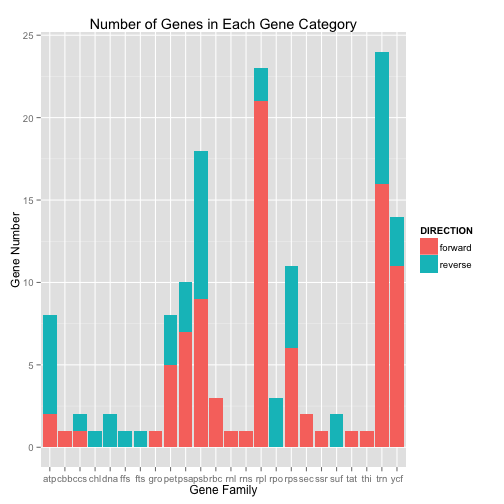

DV_RProject2
========================================================
Group member: Anna Mengjie Yu (my3852),  Duy Vu (dhv242),  Syed Naqvi (san724)

This is an R Markdown document. In this project, we will be using diatom plastid genome data.

When you click the **Knit HTML** button a web page will be generated that includes both content as well as the output of any embedded R code chunks within the document. You can embed an R code chunk like this:


```r
source("../01 Data/DV_RProject2_data.R", echo = TRUE)
```

```
## 
## > require("dplyr")
```

```
## Loading required package: dplyr
## 
## Attaching package: 'dplyr'
## 
## The following object is masked from 'package:stats':
## 
##     filter
## 
## The following objects are masked from 'package:base':
## 
##     intersect, setdiff, setequal, union
```

```
## 
## > require("ggplot2")
```

```
## Loading required package: ggplot2
```

```
## 
## > require("plyr")
```

```
## Loading required package: plyr
## -------------------------------------------------------------------------
## You have loaded plyr after dplyr - this is likely to cause problems.
## If you need functions from both plyr and dplyr, please load plyr first, then dplyr:
## library(plyr); library(dplyr)
## -------------------------------------------------------------------------
## 
## Attaching package: 'plyr'
## 
## The following objects are masked from 'package:dplyr':
## 
##     arrange, count, desc, failwith, id, mutate, rename, summarise,
##     summarize
```

```
## 
## > require("RCurl")
```

```
## Loading required package: RCurl
## Loading required package: bitops
```

```
## 
## > require("reshape2")
```

```
## Loading required package: reshape2
```

```
## 
## > require("tidyr")
```

```
## Loading required package: tidyr
```

```
## 
## > require("grid")
```

```
## Loading required package: grid
```

```
## 
## > require("graphics")
## 
## > require("gplots")
```

```
## Loading required package: gplots
## 
## Attaching package: 'gplots'
## 
## The following object is masked from 'package:stats':
## 
##     lowess
```

```
## 
## > require("bitops")
## 
## > require("stats")
## 
## > df_cyclotella1 <- data.frame(eval(parse(text = substring(getURL(URLencode("http://129.152.144.84:5001/rest/native/?query=\"select * from gene\""), 
##  .... [TRUNCATED] 
## 
## > df_cyclotella1 %>% tbl_df
## Source: local data frame [140 x 5]
## 
##              NAME MINIMUM MAXIMUM LENGTH DIRECTION
## 1       psaA gene     103   2,361  2,259   forward
## 2       psaB gene   2,478   4,679  2,202   forward
## 3       petF gene   4,912   5,244    333   reverse
## 4      rpl20 gene   5,425   5,844    420   reverse
## 5      rpl35 gene   5,854   6,048    195   reverse
## 6      ycf42 gene   6,055   6,690    636   reverse
## 7       psaE gene   6,792   6,989    198   reverse
## 8  trnR(ucu) gene   7,154   7,226     73   reverse
## 9  trnV(uac) gene   7,237   7,308     72   reverse
## 10      psbH gene   7,575   7,775    201   reverse
## ..            ...     ...     ...    ...       ...
```

```r
source("../02 Data Wrangling/geneFamily.R", echo = TRUE)
```

```
## 
## > df_gene <- df_cyclotella1 %>% mutate(gene_family = substr(NAME, 
## +     1, 3)) %>% group_by(gene_family)
## 
## > df_gene %>% tbl_df
## Source: local data frame [140 x 6]
## 
##              NAME MINIMUM MAXIMUM LENGTH DIRECTION gene_family
## 1       psaA gene     103   2,361  2,259   forward         psa
## 2       psaB gene   2,478   4,679  2,202   forward         psa
## 3       petF gene   4,912   5,244    333   reverse         pet
## 4      rpl20 gene   5,425   5,844    420   reverse         rpl
## 5      rpl35 gene   5,854   6,048    195   reverse         rpl
## 6      ycf42 gene   6,055   6,690    636   reverse         ycf
## 7       psaE gene   6,792   6,989    198   reverse         psa
## 8  trnR(ucu) gene   7,154   7,226     73   reverse         trn
## 9  trnV(uac) gene   7,237   7,308     72   reverse         trn
## 10      psbH gene   7,575   7,775    201   reverse         psb
## ..            ...     ...     ...    ...       ...         ...
## 
## > df_avg_len <- df_gene %>% group_by(gene_family) %>% 
## +     summarize(avg_gene_length = mean(LENGTH))
```

```
## Warning in mean.default(LENGTH): argument is not numeric or logical:
## returning NA
```

```
## 
## > df_avg_len %>% tbl_df
## Source: local data frame [1 x 1]
## 
##   avg_gene_length
## 1              NA
```

Figure 1

```r
source("../03 Visualizations/DV2_Visualization.R", echo = TRUE)
```

```
## 
## > ggplot(data = df_gene, mapping = aes(x = gene_family)) + 
## +     layer(geom = "bar", mapping = aes(fill = DIRECTION))
```

 


